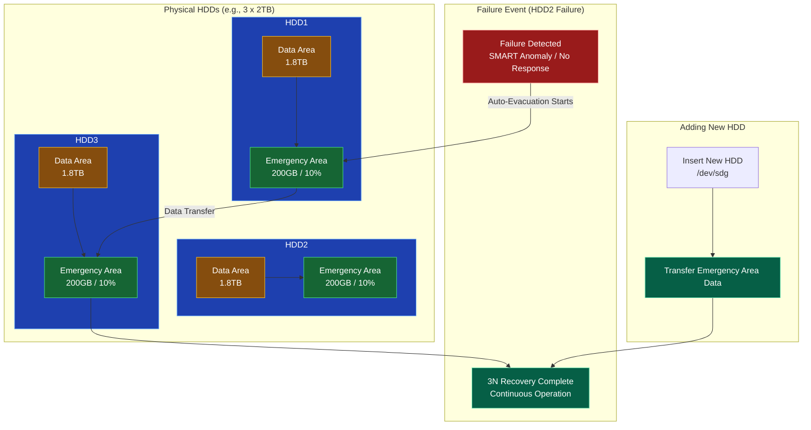
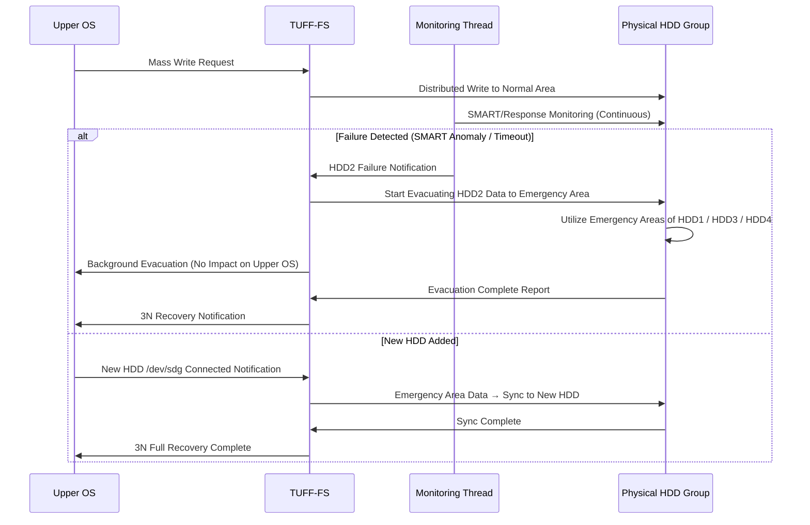

# TUFF-FS Emergency Area Specification

The Emergency Area is a core fault-tolerance feature of TUFF-FS, which "**consistently reserves 10% of each HDD to automatically evacuate data to other healthy disks in the event of a failure.**"

### 1. Overview of the Emergency Area (Diagram)



### 2. Detailed Operational Flow (Step-by-Step)



### 3. Key Rules and Specifications

| Item | Specification Detail | Remarks / Benefits |
|:---|:---|:---|
| **Reservation Rate** | **10%** of total HDD capacity (default, configurable) | Always ensures minimum evacuation capacity. |
| **Placement** | End of each HDD (allocated backwards from last LBA) | Optimized for sequential writes. |
| **Usage Timing** | Failure/Anomaly detected in 1 HDD → Uses others' Emergency Area | Maintains 3N without downtime. |
| **Re-sync (Rebuild)** | Auto-transfers data from Emergency Area upon new HDD insertion | Supports hot-swapping. |
| **In Isolation Mode** | New evacuations to Emergency Area are halted (All reservations locked) | Complete freeze during final defense. |
| **Capacity Depletion** | Emergency Area full → Temporarily suspends new writes | Works with UQ back-pressure to prevent data loss. |
| **Monitoring Interval** | SMART check: Every 1 min<br>Response timeout: Detected after 5s x 3 failures | Early discovery and early evacuation. |

### 4. Operational Tips for Administrators

- **Periodic Check Command**
  ```bash
  tuffutl fs status --detail | grep Emergency
  ```
  → Displays the usage rate and free capacity of each HDD's Emergency Area.

- **Forced Evacuation Test (Drill)**
  ```bash
  tuffutl fs emergency simulate --disk /dev/sdc
  ```
  → Treats one HDD as a simulated failure → Verify evacuation behavior (Recommended for test environments).

- **Recommendation for New HDDs**
  Ensure the capacity is equal to or greater than existing HDDs to prevent Emergency Area shortage.

- **Alert on Depletion**
  Warnings are logged to witness.log if usage exceeds 90% (Optional notification to Upper OS).

---

### Summary

The TUFF-FS Emergency Area is the mechanism at the heart of TUFF-OS fault tolerance: "**Even if one physical disk dies suddenly, the system continues to maintain 3N redundancy without downtime by utilizing the free space on other HDDs.**"

- 10% always reserved → Acts as an evacuation buffer.
- Anomaly detection → Automatic evacuation starts.
- New HDD added → Automatic re-sync for full recovery.

This ensures that **a physical disk failure does not lead to a system-wide shutdown**, realizing the absolute resilience of TUFF-OS.
