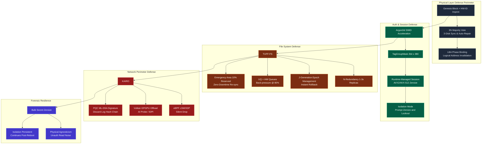
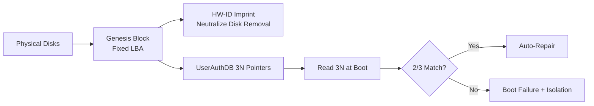
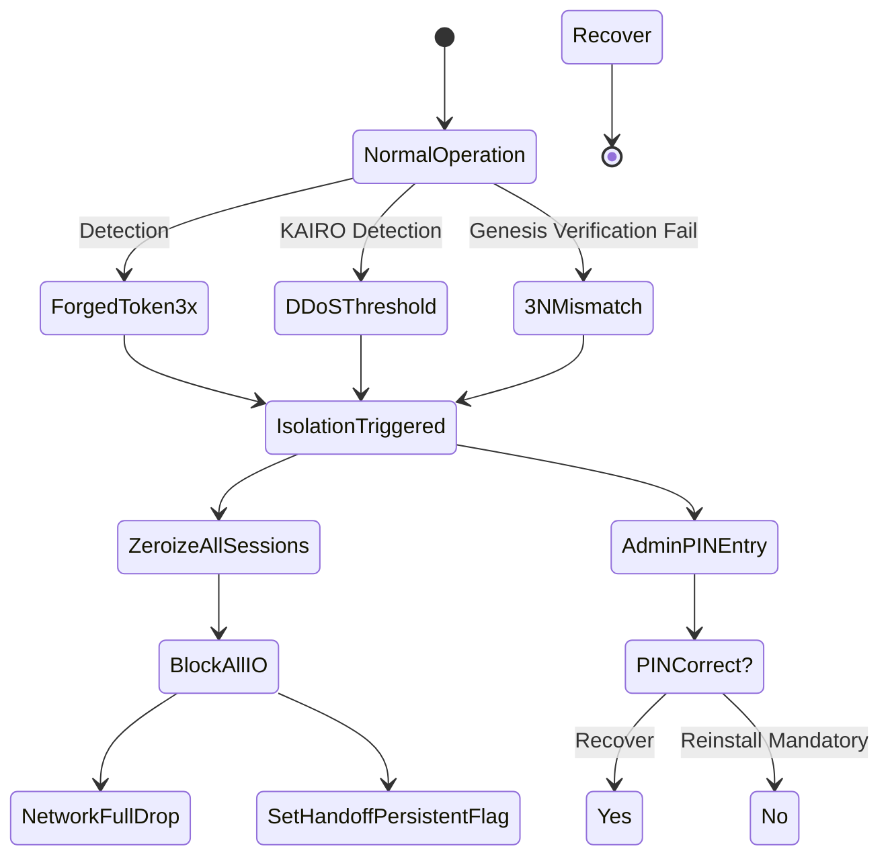
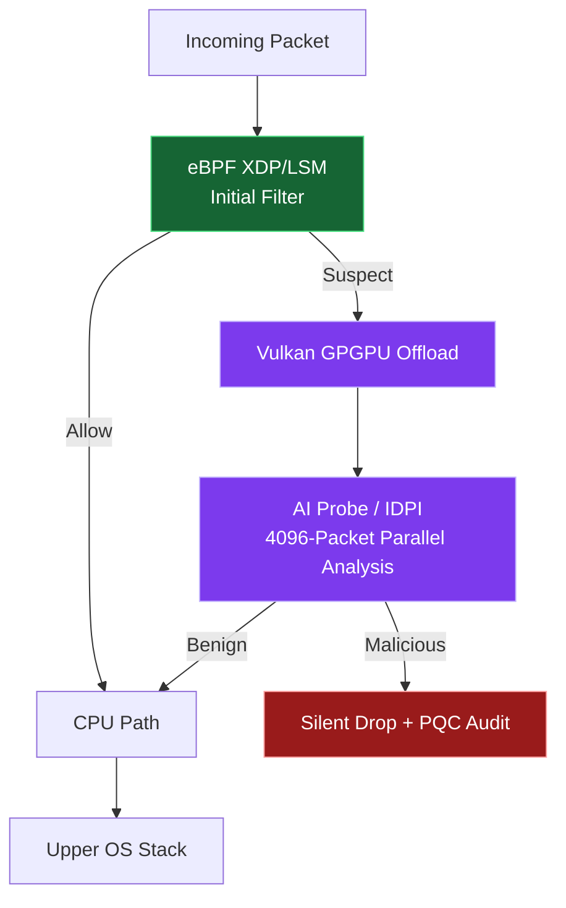

# TUFF-OS Security Implementation Overview Diagram

This document provides a detailed summary of the **holistic security implementation** of TUFF-OS, primarily through diagrams. It is designed to be visually intuitive for each critical feature.

### TUFF-OS Security Implementation Overview (Holistic View)



---

### Detailed Layer Diagrams

#### 1. Physical Layer Defense (The Foundation of Foundations)



#### 2. Isolation Mode Trigger & Recovery Flow



#### 3. TUFF-FS Protection Layer (Separation of N-Redundancy vs J-Generation)

```mermaid
flowchart LR
    subgraph NRedundancyZone [N-Redundancy Area (Immediate)]
        N1[Start Write] --> N2[Simultaneous Multi-HDD Write]
        N2 --> N3[Commit / Reject]
        N3 --> N4[Immediate Commit<br>No Rollback]
    end

    subgraph JGenerationZone [J-Generation Area (Generational)]
        J1[Start Write] --> J2[Write to New LBA<br>Old LBA Preserved]
        J2 --> J3[Epoch Increment]
        J3 --> J4[Rollback Possible<br>Restore via Pointer Switch]
    end

    N1 ~~~|Separation| J1
```

#### 4. KAIRO Network Defense (GPGPU Offload)



---

### Summary: The 5-Layer Security Structure of TUFF-OS

1. **Physical Layer**: Tamper-proof root of trust (Genesis + 3N).
2. **Authentication Layer**: Robust key derivation and instant Zeroize (Argon2id + AVX Zeroize).
3. **FS Layer**: Separation of immediacy and history protection (N-Redundancy + J-Generation).
4. **Network Layer**: Perimeter defense with zero CPU load (KAIRO + GPGPU).
5. **Final Defense**: Immediate anomaly isolation and zero traces (Isolation + Agnosticism).
