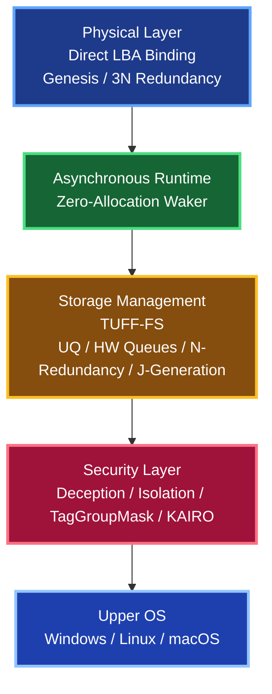
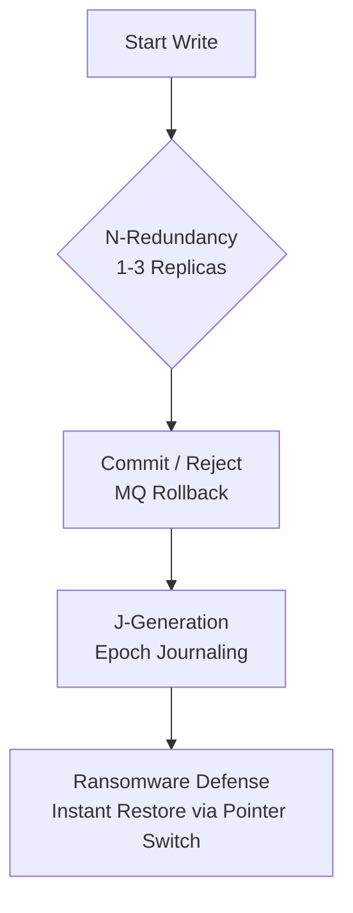
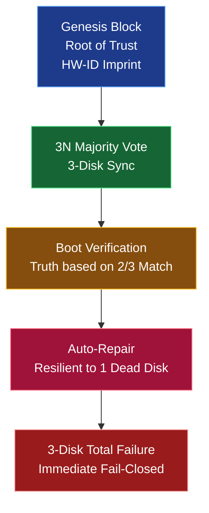
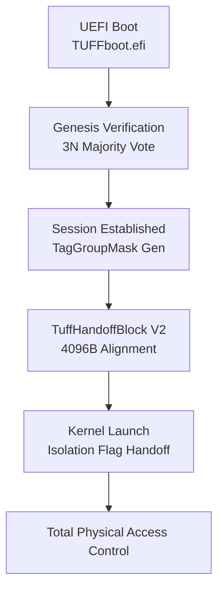

# TUFF-OS Detailed Technical Manual

**Final Edition (Visualized & Mermaid Integrated)**

---

## 1. Architectural Overview

TUFF-OS is a security foundation OS that runs in the **lower layer** relative to the Upper OS (Windows, Linux, macOS, etc.). It eliminates the vulnerabilities of logical file systems by combining **direct physical sector (LBA) access** with **mathematical cryptography (KEY-CSE)** to establish an "Absolute Defense Perimeter."

---

## 2. Storage Subsystem Details

### 2.1 Block Devices and LBA Binding
While recognized as a "JBOD (a single massive virtual drive)" by the Upper OS, TUFF-OS **directly manages the LBAs of each physical HDD** internally. Because there is no logical structure based on metadata exposed to the Upper OS, tampering with file tables or logical forensics is **physically impossible**.

### 2.2 UQ (Unique Queue) and HW Queue Mechanism

- **UQ (Unique Queue)**: A buffer zone that handles all write requests from the Upper OS. Data is compressed on ZRAM and encrypted via KEY-CSE.
- **Back-pressure Control**: When UQ usage reaches a threshold (default 80%), the system safely sends an I/O block signal to the Upper OS to prevent system failure.
- **HW Queues and Dispatch**: Encrypted data is distributed to HW queues for each physical HDD. The HDD with the lowest I/O load is dynamically selected, and data is written sequentially to minimize seek latency.
- **Read-Priority Control**: When a read request enters the queue, ongoing write processes are suspended to prioritize the read, reducing physical disk wear.

### 2.3 Data Protection Layer (N-Redundancy / J-Generation)

- **N-Redundancy (1-3 Replicas)**: Replicates data across physical disks. Transaction management ensures that even during a power cut while writing, the Message Queue (MQ) performs a rollback, preventing even a single bit of data loss.
- **J-Generation (Epoch Journaling)**: Instead of overwriting original LBAs, updates are written to different LBAs as a new Epoch. This allows **instant restoration to past generations** by simply switching index pointers, even after a ransomware encryption attack.

### 2.4 Emergency Area and Rebuilds
Consistently reserves 10% (default) of all HDD capacity. If signs of disk failure (SMART errors, etc.) are detected, the data from that disk is evacuated to the Emergency Areas of other healthy disks in the background. When a new HDD is hot-attached, data is automatically re-synced (Appended), completing a **zero-downtime rebuild**.

---

## 3. Asynchronous Runtime and Memory Management

### 3.1 Zero-Allocation Waker

TUFF-Core asynchronous processing performs no dynamic memory allocation (heap allocation). Task waking is performed via `AtomicU32` bitmap notifications, resuming tasks in O(1) constant time from an interrupt (IRQ). This prevents OOM (Out-of-Memory) and kernel panics even under extreme load.

### 3.2 ZRAM and SIMD Zeroize
Session info and permission tags (TagGroupMask) are deployed entirely on ZRAM. Upon transitions to Isolation mode or logouts, **256/512-bit SIMD store instructions (AVX2 / AVX-512)** are used to wipe sensitive memory data in a fraction of a millisecond.

---

## 4. Security and Network Defense

### 4.1 Physical Deception (ChaCha20 Read Deception)
Against unauthenticated attempts to read the physical disk directly, the system returns "consistent noise" based on a ChaCha20 stream cipher seeded with the LBA phase and hardware ID. Using AVX2 8-lane parallel processing, it generates infinite noise without stressing the CPU.

### 4.2 Proprietary KEY-CSE Cryptography
Features a proprietary stream cipher with a total key length of 768 bits. Decryption is mathematically impossible without both the physical key (stored on a USB drive or external device) and the user's authentication token.

### 4.3 Network Defense Grid (KAIRO-P)
- **eBPF (LSM/XDP) Intercept**: Monitors packets in kernel space and Silent Drops unauthorized ports or connections before they reach the OS stack.
- **Vulkan GPGPU Offload**: Offloads large-scale DDoS (SYN Flood, etc.) and L7 payload analysis (IDPI) to the iGPU, neutralizing attacks while maintaining 0.0% CPU usage.
- **PQC (Post-Quantum Cryptography) Audit**: Discarded packet logs are hashed and signed using MlDsa-44 quantum-resistant signatures, creating an unalterable audit trail.

---

## 5. Boot Process and Handoff

### 5.1 TuffHandoffBlock V2

Authentication sessions and security states established during the UEFI phase are safely passed to the kernel via a 4096-byte aligned Handoff block. If Isolation is triggered at the UEFI stage, that flag is also passed, ensuring physical access blockade continues after the OS boots.
