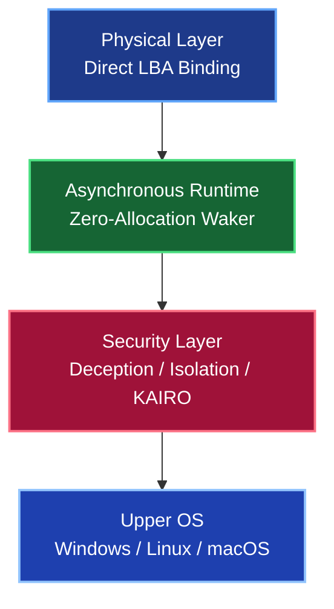
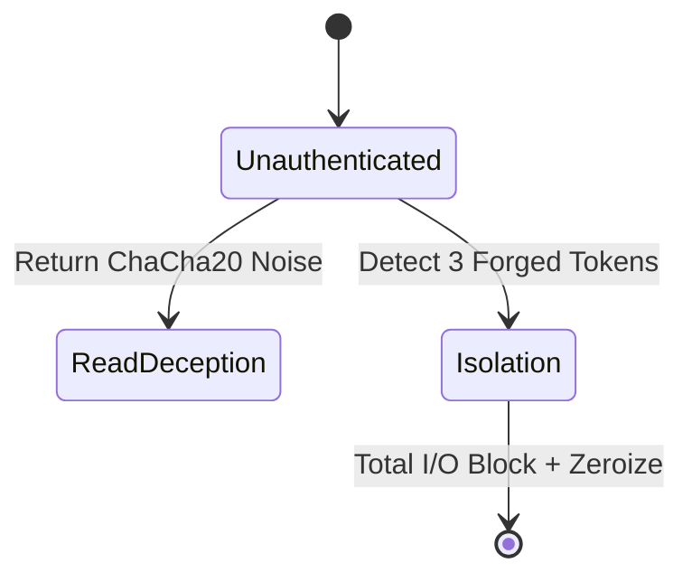

# TUFF-OS General Manual

## 1. What is TUFF-OS?

**TUFF-OS (The Ultimate Fortress Foundation OS)** is a fortified operating system designed to **fundamentally eliminate logical vulnerabilities** present in existing operating systems and file systems at the **physical layer level**. Its goal is to establish complete data self-sovereignty and an "Absolute Defense Perimeter."

TUFF-OS operates as a **lower-layer OS** beneath your existing primary OS (Linux / Windows / macOS). It maintains complete control over all HDD accesses from the Upper OS at the physical layer. This allows all data to be encrypted and protected without the Upper OS's awareness, enabling different security levels on a per-directory basis.

### Required Storage Configuration
- **SSD**: OS installation area, Physical Queue (UQ) area.
- **HDD**: Any manufacturer/capacity (no limit on concurrent connections).
- **Mass Storage**: For data evacuation during failures.
- **USB Drive**: For storing CSE cryptographic keys.

The HDD area is recognized as a "JBOD (single unified volume)" by the Upper OS, but TUFF-OS manages it entirely at the physical layer.

TUFF-OS maintains user management completely independent of the Upper OS. Data is accessible **only while logged in**. Without an active session, **the existence of the data itself cannot be recognized** (Physical Agnosticism).

---

## 2. Core Architecture

### 2.1 Physical Layer Bound Storage
TUFF-OS replaces traditional logical management centered on metadata with **direct I/O issuance to the physical sectors (LBA)** of the storage. This physically neutralizes invisible tampering or logical forensic attacks from upper layers.

### 2.2 Ultra-Lightweight Asynchronous Runtime (Zero-Allocation Waker)
The OS core operates on a proprietary asynchronous runtime that performs no dynamic memory allocation. It does not monopolize the CPU even under heavy I/O or network attacks. By processing tasks efficiently in the background, it completely prevents system-wide resource exhaustion.

---

## 3. Key Features

### 3.1 Root of Trust & Redundancy (Genesis & 3N Majority Vote)

- **Genesis Block**: The root of trust for the system. Written to a specific sector of the disk and imprinted with a Hardware-Unique ID (HW-ID).
- **3N Majority Vote**: Critical data is always synchronized across three different physical disks. At boot, the system reads all three; if at least two match, that data is adopted as "Truth," and any corrupted replicas are automatically repaired.

### 3.2 Advanced File System (TUFF-FS)

#### Core Components

- **UQ + HW Queues**: Writes are aggregated into a single queue and dispatched to the optimal HDD, minimizing Read/Write collisions.
- **Emergency Area**: 10% of all HDD capacity is reserved. Failures trigger automatic evacuation and zero-downtime re-sync.
- **N-Redundancy**: Replica counts are specified per folder. Commit/Reject ensures atomic finalization.
- **J-Generation**: Manages change history via generations (Epochs). Allows instant rollback to past states.

**Performance Validation (2000 File Write Test)**
- **Total Duration**: 6.13 seconds.
- **Avg. Rate**: **326.32 files/s**.
- **Disk Utilization**: **0.40%** (Data device).
- **Effective Throughput**: Approx. 2.05 GB/s.

While standard file systems reach 50–100% disk utilization during similar loads, TUFF-FS achieves high-speed processing with the physical disks nearly idle, thanks to MQ aggregation and an asynchronous scheduler.

### 3.3 Physical Deception & Defense (Deception & Isolation)

- **Read Deception**: Returns meaningless noise generated via AVX2 to unauthenticated `dd` attempts.
- **Isolation Mode**: Immediate transition upon 3 consecutive forged tokens. Completely wipes sensitive info within 1ms.

### 3.4 Network Defense (KAIRO)

- **eBPF Intercept**: Silent Drops unauthorized traffic before it reaches the OS stack.
- **Vulkan GPGPU Offload**: Processes AI Probe / IDPI on the GPU. Neutralizes 10Gbps attacks with 0.0% CPU usage.

### 3.5 Permission Control (TagGroupMask)

Tags are assigned to folders, and access is determined via bitwise operations against the user's **TagGroupMask**. For unauthorized users, folders are completely hidden (spoofed as "Not Found").

---

## 4. Operation & Management

All system operations are conducted exclusively through the **`tuffutl`** utility. Environment-specific Web-UIs are provided for the Upper OS, which execute `tuffutl` commands in the background.

This allows for **safe and intuitive** execution of physical operations, such as user management, FS monitoring, commits, rollbacks, and network policy changes.

---

**TUFF-OS is the ultimate defense platform for the AI-native era, realizing "Absolute Data Sovereignty" rooted in the physical layer.**
