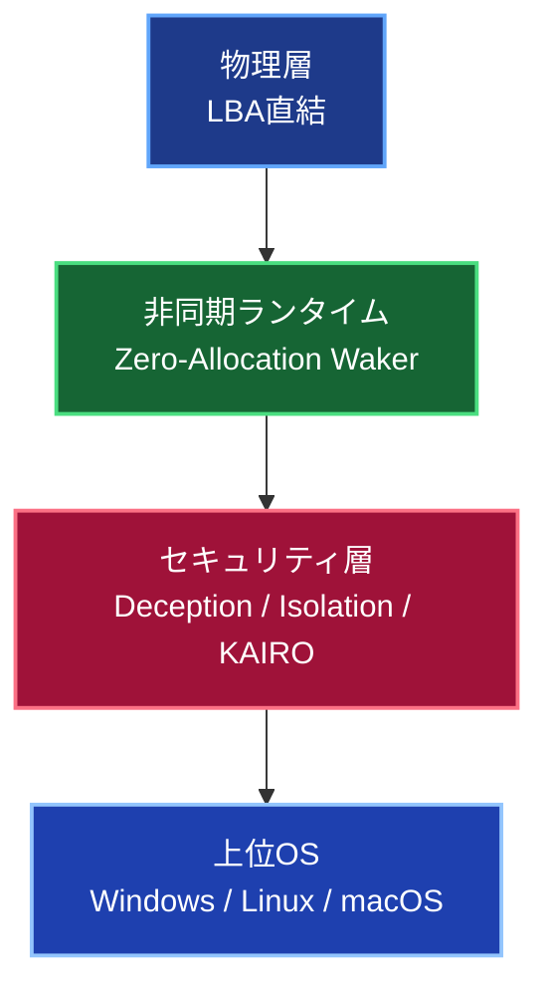
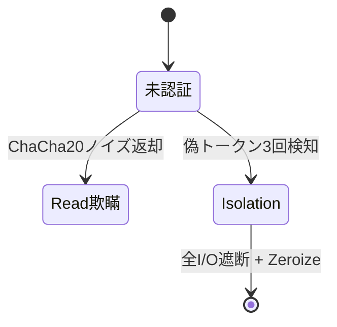

**TUFF-OS 総合説明書（最終版・視覚改善済み）**

## 1. TUFF-OSとは

**TUFF-OS（The Ultimate Fortress Foundation OS）**は、既存OSやファイルシステムが抱える論理的脆弱性を**物理層レベルで根本的に排除**し、完全なるデータの自己主権と「絶対防衛圏」を確立するために設計された要塞型オペレーティングシステムです。

本OSは、既存OSの**下位OS**として動作し、上位OS（Linux / Windows / macOS）からのすべてのHDDアクセスを物理層で完全制御します。これにより、上位OSに意識させることなく、すべてのデータを暗号化・保護し、ディレクトリ単位で異なるセキュリティレベルを実現します。

### 必要なストレージ構成
- **SSD**：OSインストール領域、物理キュー領域
- **HDD**：容量・メーカー不問（同時接続上限なし）
- **大容量ストレージ**：障害時データ退避用
- **USBメモリ**：CSE暗号鍵格納用

HDD領域は上位OSからは「JBOD（単一の統合領域）」として認識されますが、実際はTUFF-OSが物理層で完全管理しています。

本OSは上位OSと完全に独立したユーザー管理を行っており、**ログイン中のみ**データにアクセス可能。未ログイン状態では**データの存在自体を認識できません**（物理的不可知性）。

---

## 2. コア・アーキテクチャ

### 2.1 物理層直結型ストレージ
従来のファイルシステムのようなメタデータ中心の論理管理を廃止し、**ストレージの物理セクタ（LBA）へ直接I/Oを発行**します。これにより、上位層からの不可視改ざんやフォレンジック攻撃を物理的に無効化します。

### 2.2 超軽量非同期ランタイム（Zero-Allocation Waker）
OSコアは動的メモリ確保を一切行わない独自の非同期ランタイムで動作します。大量I/Oやネットワーク攻撃を受けてもCPUを占有せず、バックグラウンドで効率的に処理することで、システム全体のリソース枯渇を完全に防止します。

---

## 3. 主要機能

### 3.1 信頼の起点と冗長化（Genesis & 3N Majority Vote）

- **Genesisブロック**：システムの信頼起点。ディスク特定セクタに書き込まれ、ハードウェア固有ID（HW-ID）が刻印されています。
- **3N多数決**：重要データは常に3つの異なる物理ディスクに同期。起動時に3データを読み込み、2つ以上一致するものを「真実」として採用し、破損分を自動修復します。

### 3.2 高度ファイルシステム（TUFF-FS）

#### 主要構成要素

- **UQ + HWキュー**：書き込みは単一キューで集約され、最適HDDへ投入。Read/Write衝突を最小化。
- **避難領域**：全HDDに10%空きを確保。障害時は自動退避・無停止再同期。
- **N冗長**：フォルダ単位で複製数指定。コミット/リジェクトでアトミック確定。
- **J世代**：変更履歴を世代管理。一瞬で過去状態へロールバック可能。

**パフォーマンス実証（2000ファイル書き込みテスト）**  
- **合計処理時間**：6.13秒  
- **平均ファイル処理速度**：**326.32 files/s**  
- **ディスク使用率**：**0.40%**（Dataデバイス）  
- **実効データ転送量**：約2.05 GB/s  

通常のファイルシステムでは同規模書き込みでディスク使用率50〜100%になるのに対し、TUFF-FSはMQ集約と非同期スケジューラにより物理ディスクをほぼ遊ばせた状態で高速処理を実現しています。

### 3.3 物理デセプションと防衛（Deception & Isolation）

- **Read欺瞞**：未認証ddに対しAVX2生成の意味のないノイズを返却。
- **Isolationモード**：不正トークン3回で即移行。機密情報を1ms以内に完全消去。

### 3.4 ネットワーク防衛（KAIRO）

- **eBPFインターセプト**：未承認通信をOSスタック到達前にSilent Drop。
- **Vulkan GPGPUオフロード**：AI Probe / IDPIをGPUで処理。CPU使用率0.0%で10Gbps攻撃を無効化。

### 3.5 権限制御（TagGroupMask）

フォルダ単位にタグを付与し、ユーザーの**TagGroupMask**とビット演算でアクセス権を決定。権限のないユーザーに対しては「フォルダが存在しない」として**存在自体を秘匿**します。

---

## 4. 運用と管理

システムの全操作は専用ツール **`tuffutl`** によってのみ行われます。上位OSには環境に応じたWeb-UIを配置し、そのUIを通して背後の`tuffutl`を実行します。

これにより、ユーザー管理、FS監視・コミット・ロールバック、ネットワークポリシー変更など、全ての物理操作を**安全かつ直感的に**行うことができます。

---

**TUFF-OSは、物理層に根ざした「データの絶対主権」を実現する、AIネイティブ時代のための究極の防衛プラットフォームです。**
