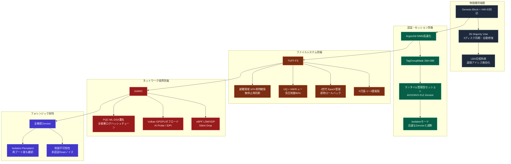
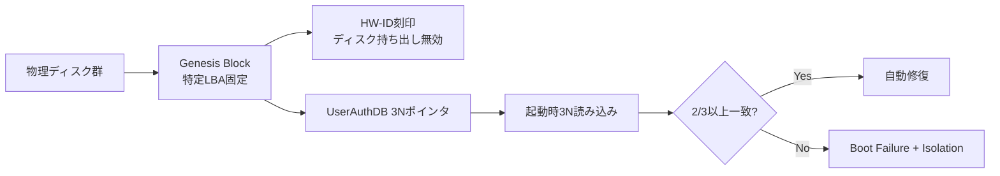

以下は、TUFF-OSの**総合セキュリティ実装**を、図解を主軸にまとめた詳細資料です。  
各機能の重要ポイントをできるだけ視覚的に理解しやすく構成しました。

### TUFF-OS 総合セキュリティ実装 概要図（全体像）

### 各レイヤーの詳細図解

#### 1. 物理層防衛（基盤中の基盤）

### 2. Isolationモード発動・解除フロー

```mermaid
stateDiagram-v2
    [*] --> 通常運用
    通常運用 --> 偽トークン3回: 検知
    通常運用 --> DDoS閾値超過: KAIRO検知
    通常運用 --> 3N不一致: Genesis検証失敗

    偽トークン3回 --> Isolation発動
    DDoS閾値超過 --> Isolation発動
    3N不一致 --> Isolation発動

    Isolation発動 --> 全セッションZeroize
    全セッションZeroize --> 全I/O遮断
    全I/O遮断 --> ネットワーク完全Drop
    全I/O遮断 --> Handoff Persistentフラグセット

    Isolation発動 --> 管理者PIN入力
    管理者PIN入力 --> 正しいPINか
    正しいPINか --> Yes: 復帰
    正しいPINか --> No: 再インストール必須

    復帰 --> [*]
````

### 3.TUFF-FS 保護層（N冗長 vs J世代の分離）

```mermaid
flowchart LR
    subgraph N冗長領域 [N冗長領域（即時確定型）]
        N1[書き込み開始] --> N2[複数HDD同時書き込み]
        N2 --> N3[Commit / Reject]
        N3 --> N4[即時確定<br>Rollback不可]
    end

    subgraph J世代領域 [J世代領域（世代管理型）]
        J1[書き込み開始] --> J2[新LBAへ書き込み<br>旧LBA保持]
        J2 --> J3[Epochインクリメント]
        J3 --> J4[Rollback可能<br>ポインタ切替で過去復元]
    end

    N1 ~~~|分離| J1
````


#### 4. KAIRO ネットワーク防衛（GPGPUオフロード）

```mermaid
flowchart TD
    A[受信パケット] --> B[eBPF XDP/LSM<br>初回フィルタ]
    B -->|許可| C[CPUパス]
    B -->|疑わしい| D[Vulkan GPGPUオフロード]
    D --> E[AI Probe / IDPI<br>4096パケット並列解析]
    E -->|悪意判定| F[Silent Drop + PQC署名証跡]
    E -->|良性| C
    C --> G[上位OSスタック]

    classDef fast fill:#166534,stroke:#4ade80,color:#fff
    classDef heavy fill:#991b1b,stroke:#fca5a5,color:#fff
    classDef gpu fill:#7c3aed,stroke:#c4b5fd,color:#fff

    class B fast
    class D,E gpu
    class F heavy
```

### まとめ：TUFF-OSセキュリティの5層構造

1. **物理層** → 改ざん不可能な信頼起点（Genesis + 3N）
2. **認証層** → 強固な鍵導出と即時Zeroize（Argon2id + AVX Zeroize）
3. **FS層** → 即時性と履歴保護の両立（N冗長 + J世代）
4. **ネットワーク層** → CPUゼロ負荷の境界防衛（KAIRO + GPGPU）
5. **最終防衛** → 異常即隔離・痕跡ゼロ（Isolation + 不可知性）
